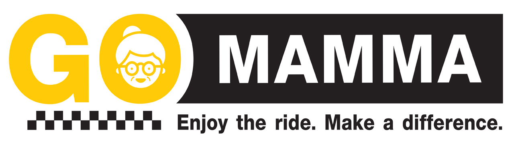
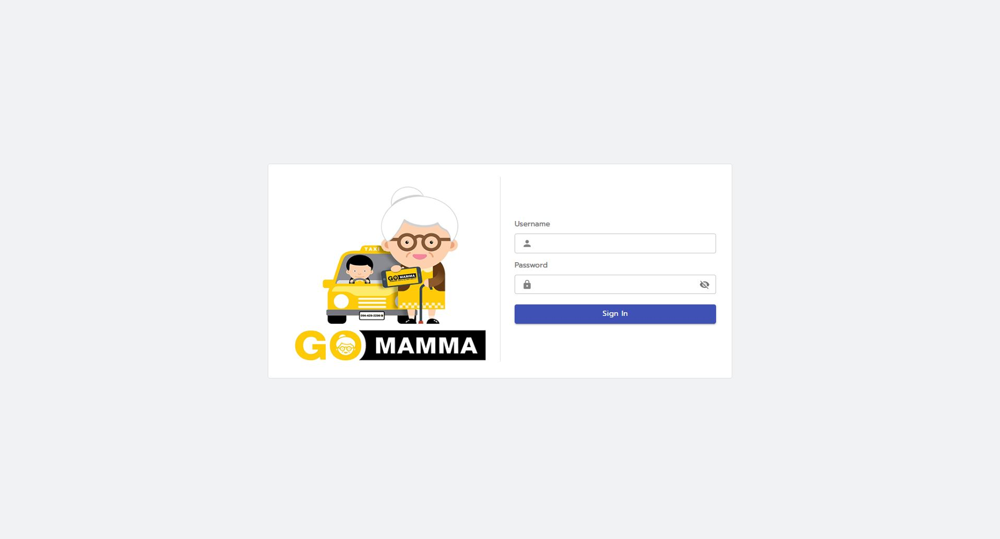
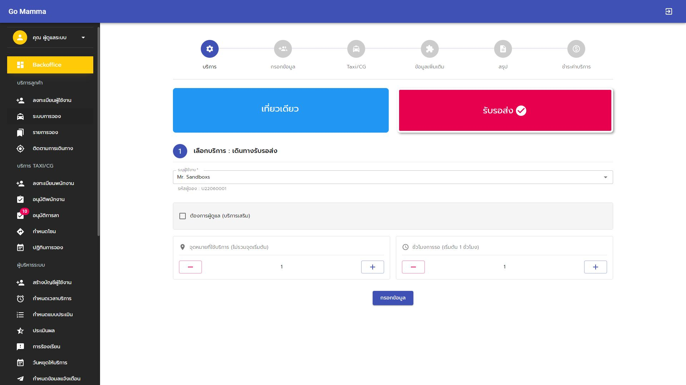
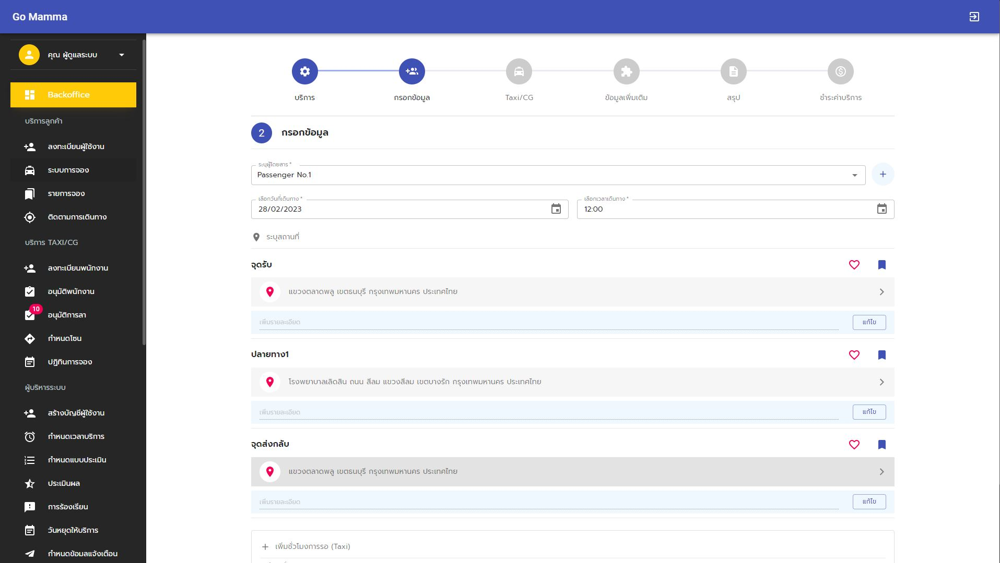
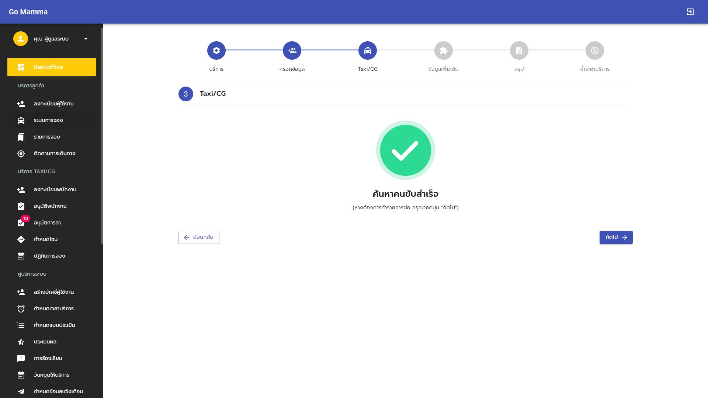
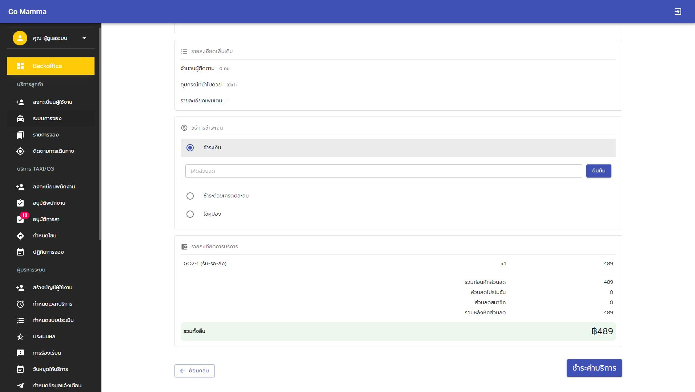
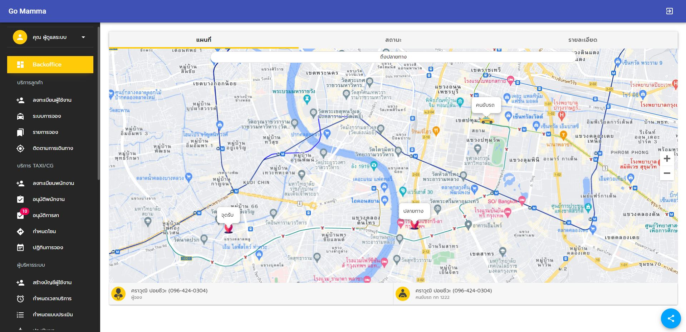

## GO MAMMA

GO MAMMA - taxi service for elderly people Travel services that are safe, reassuring, reliable, facilitating booking services for the elderly and their children, easy to use, meet every lifestyle. support outgoing life for the elderly Whether going to the mall, socializing, or going to make merit, don't worry with services that have screening standards and training staff for providing services to elderly people with different physical conditions. Understand the needs of service users Come on time Travel back and forth, can wait to use the same car Track trips in real time Notify every service point Contact video call staff at any time by pressing one button on the app. Suitable for children who don't have time to take them. Feel relieved, trustworthy

## Screenshort - Backoffice

    &nbsp; &nbsp;
    &nbsp; &nbsp;
    &nbsp; &nbsp;

    &nbsp; &nbsp;
    &nbsp; &nbsp;
    &nbsp; &nbsp;

## Tool :

Programming : ReactJS / PHP 

UI-Framwork : Material UI

## Download Application

[Available for download in Google Playstore](https://play.google.com/store/apps/details?id=com.doublem.gomamma&hl=th&gl=US)

[Available for download in Apple Store.](https://apps.apple.com/th/app/go-mamma/id1633033336)
